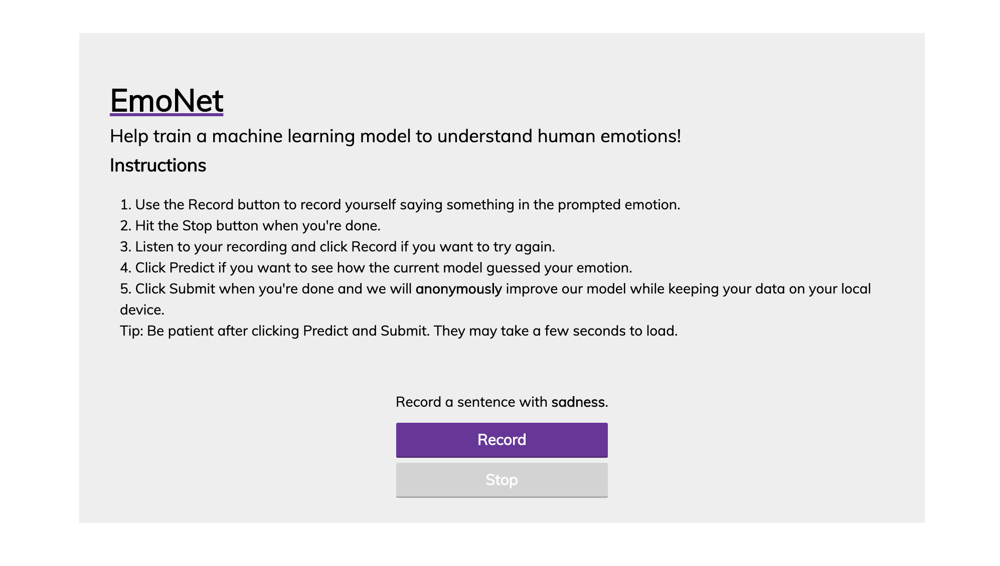
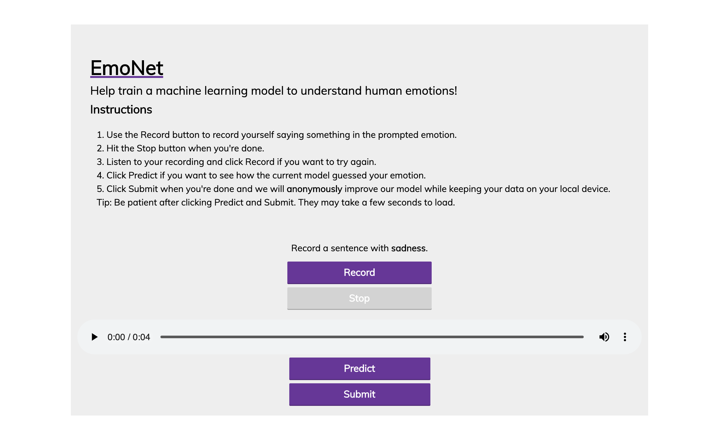

## EmoNet Client

The EmoNet Client is the user-facing frontend for end-users to record their own emotional audio, self-label, and submit it to be used to improve the federated model. 

There are two main sections:

 - Frontend Website (https://emonet.xyz)

 The frontend consists of an HTML/CSS/JS single page website that allows the user to record audio from their browser. This audio is playable and once recorded can be used to predict the current model's inference on the recording and/or submit the model to be used in federated learning.

 

 When the user records the audio, clicking predict calls the `/predict` endpoint on the backend API which pulls the most up-to-date model from the centralized server, runs an inference, and then returns the response.

 Clicking submit uses the local version of the model to train and then sends the updated model weights to the centralized server. The user can continue to submit and predict on the EmoNet site as much or as little as possible.

 

 - Backend API

 The backend API consists of a Flask app that runs the emonet.xyz site. The API has two endpoints `/process-audio` and `/predict`. 

 `/process-audio` calculates the MFCCs from the recorded audio file, pulls the most current model from the central server, trains the model using the MFCCs and label provided by the user, and sends the updated model back to the server. This could be optimized if some storage was implemented but the service was made ephemeral instead.

 `/predict` pulls the current model from the central server and runs a prediction on the MFCCs of the recorded audio file. This prediction is then used to update the frontend with the result.